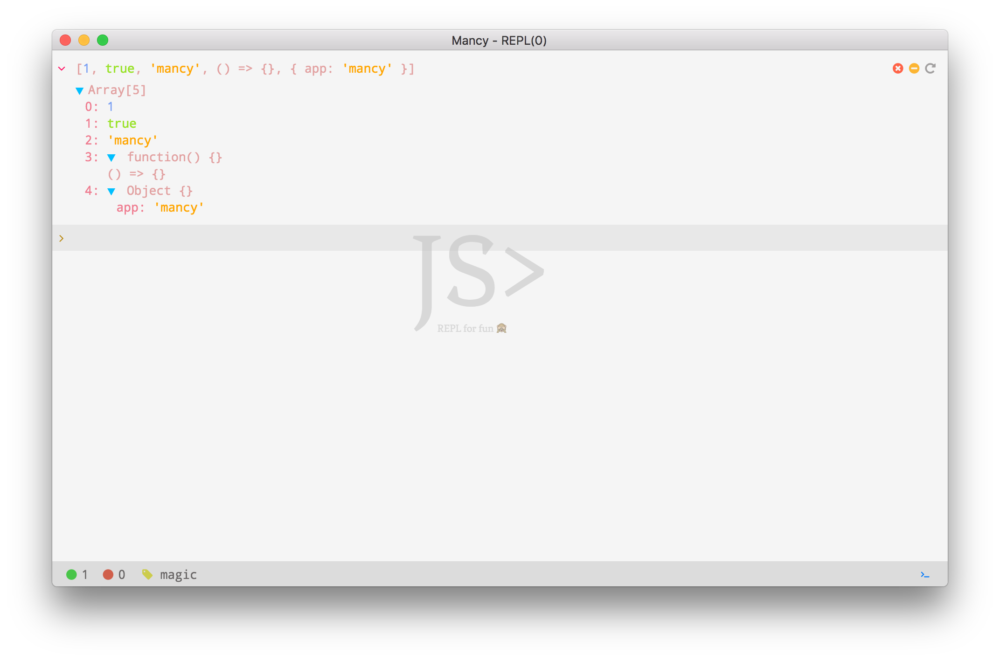
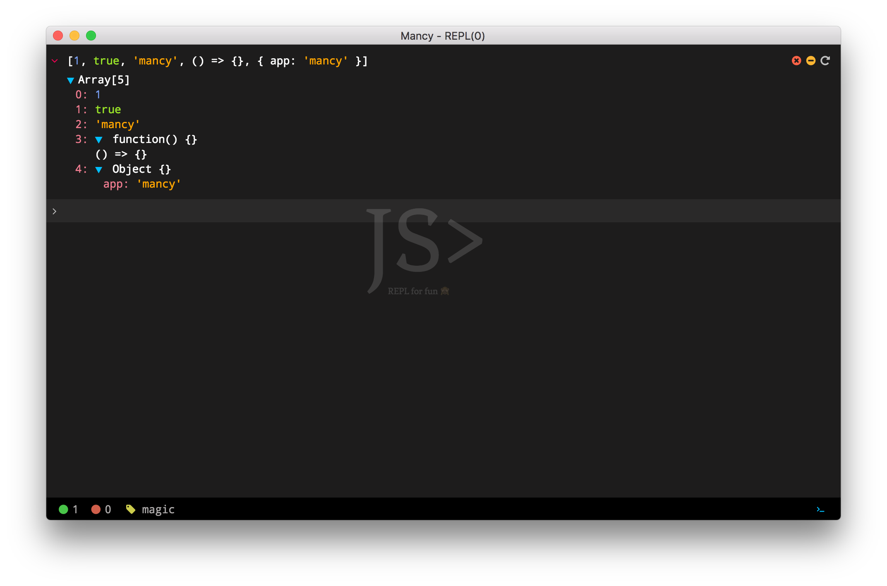
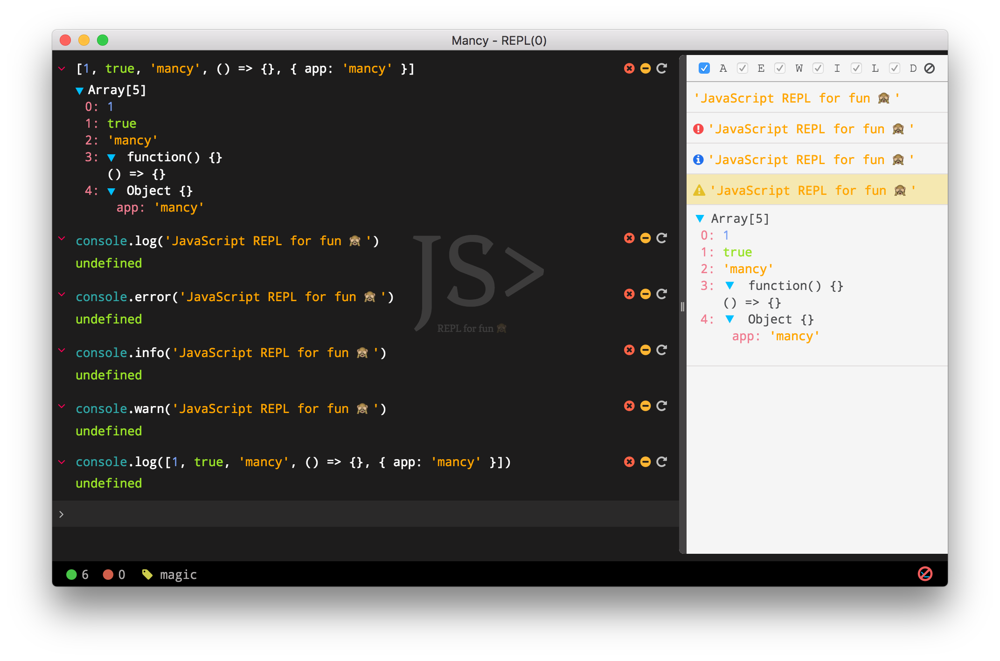
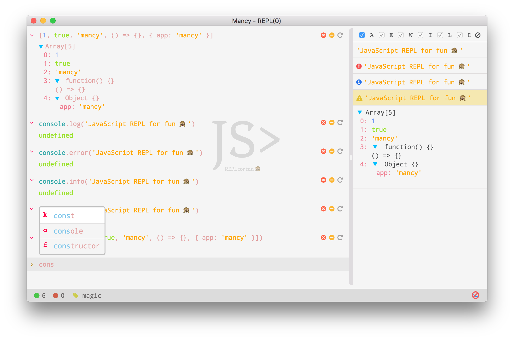
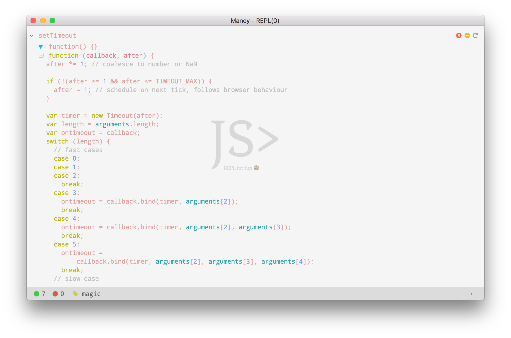

# &nbsp;Mancy

A cross platform JavaScript REPL application based on electron and react frameworks.

# &nbsp;[Features](http://mancy-re.pl)

- Syntax Highlighting
- Dark and light themes
- Import/Export command history
- Separate console window for async stdout/stderr logs
- Notification for async console logs
- console output filter support
- Traversable output with fold/unfold options
- Support for adding directory to node path
- Expand/Collapse/reload command options
- History traversal support
- Multiple window
- Multiline prompt support with <kbd>shift</kbd> + <kbd>enter</kbd>
- Auto suggestion
- Tab completion
- Code format support
- Support to toggle REPL mode
- Preferences for theme and REPL mode

&nbsp;[Screenshots](http://mancy-re.pl)

#### light theme

#### dark theme

#### console section

#### auto suggestion

#### function source

# &nbsp;Installation

- Download from [latest release](https://github.com/princejwesley/Mancy/releases/latest) (or)
- [Fork](https://github.com/princejwesley/Mancy/) and run `npm run package`

# &nbsp;Developers

[Fork](https://github.com/princejwesley/Mancy/) and run `npm run debug` or `gulp debug` to debug this application.

# &nbsp;License
[MIT License](https://github.com/princejwesley/Mancy/blob/master/LICENSE.md)
