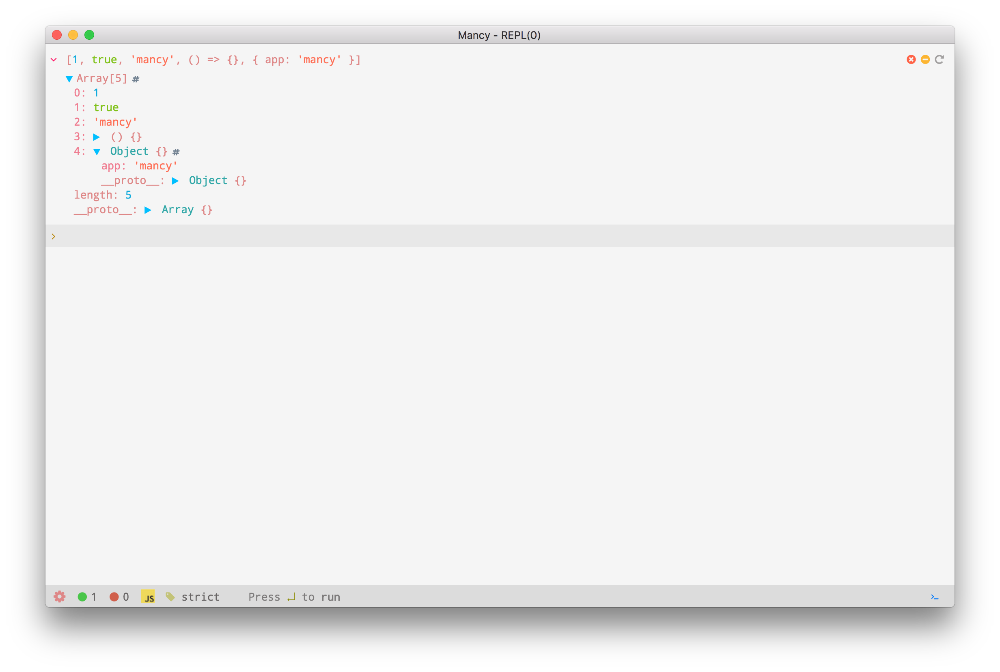
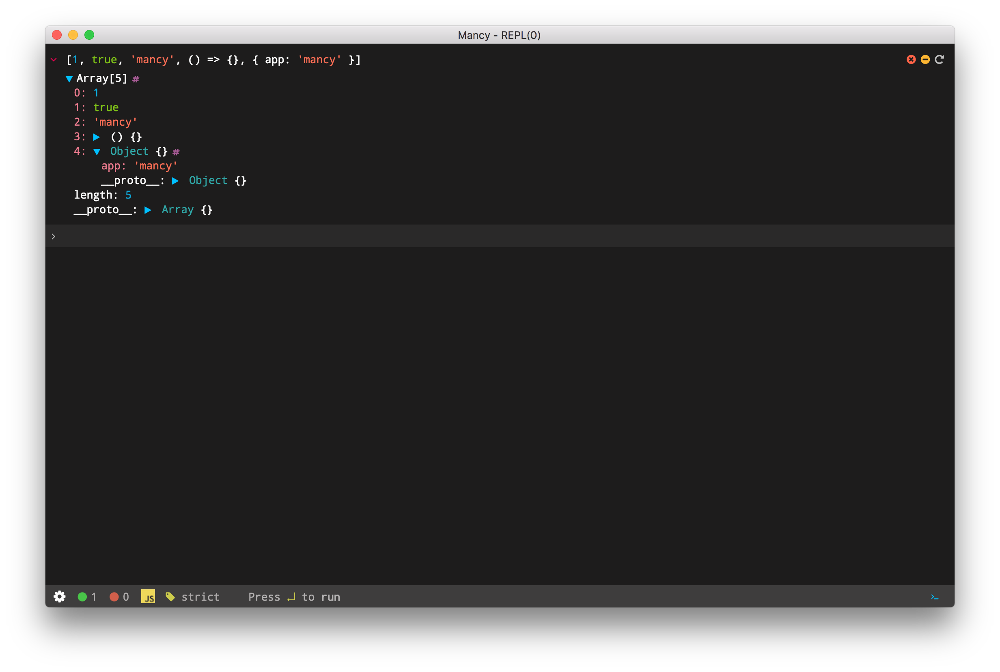
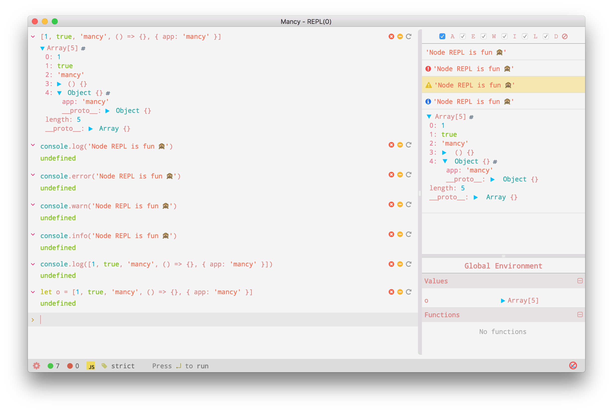
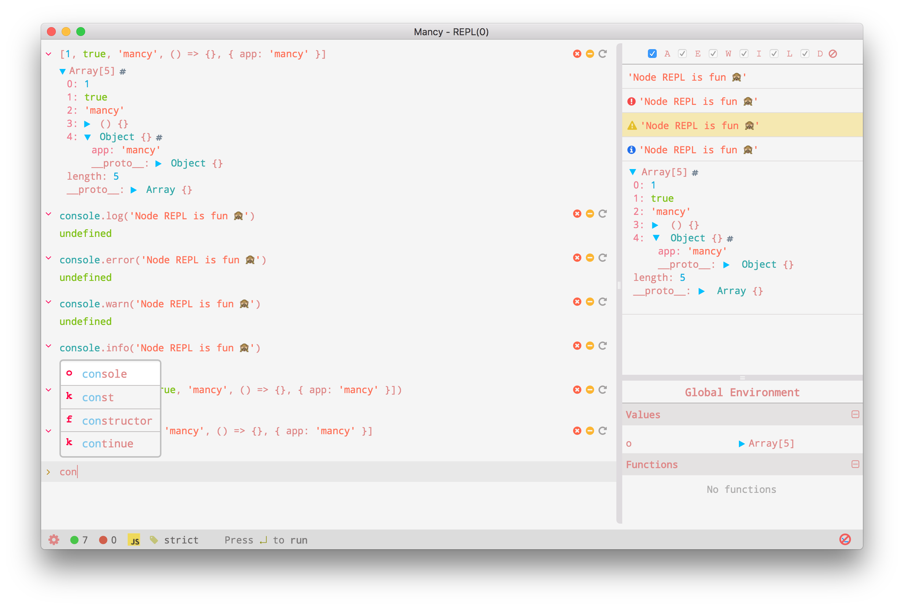
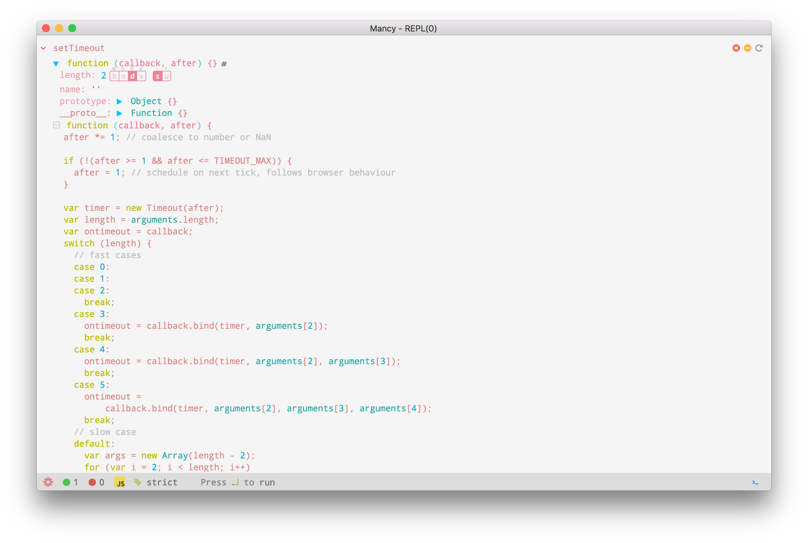

# &nbsp;Mancy

A cross platform NodeJS REPL application based on electron and react frameworks.

## &nbsp;[Language Support](http://mancy-re.pl)

- [JavaScript](https://en.wikipedia.org/wiki/JavaScript)
- [CoffeeScript](http://coffeescript.org/)
- [TypeScript](http://www.typescriptlang.org/)
- [LiveScript](http://livescript.net/)
- [ClojureScript](http://clojure.org/about/clojurescript)

## &nbsp;[Features](http://mancy-re.pl)

- Syntax Highlighting
- Dark and light themes
- Load and save session history
- Separate console window for async stdout/stderr logs
- Notification for async console logs
- console output filter support
- Traversable output with fold/unfold options
- Support for adding directory to node path
- Expand/Collapse/reload command options
- History traversal support
- Multiple window
- Multiline prompt support with <kbd>shift</kbd> + <kbd>enter</kbd>
- Auto suggestion
- Tab completion
- Code format support
- Support to toggle REPL mode
- Preferences for theme and REPL mode

#### &nbsp;[Version II :star2:](https://github.com/princejwesley/Mancy/wiki/Version-II)

-  Download npm modules on demand
-  Babel support
-  await with auto async wrapper
-  Data visualization support
   -  Integer representation (bin/oct/dec/hex and signed/unsigned)
   -  Regular expression live editor
   -  Buffer explorer
   -  HTML view
   -  CSS color view
   -  base64 detection
   -  Basic chart representation of data
   -  Image detection / display
   -  Download buffers support
-  Support to break long lasting commands
-  Preference window
-  Promise output tracking
-  Source file open support for node modules(`.source name`)
-  No special meaning for `_`
-  Syntax highlight as we type

For more detailed documentation, [read here](https://github.com/princejwesley/Mancy/wiki/Version-II)

## &nbsp;[Wiki](http://github.com/princejwesley/Mancy/wiki)
[wiki](http://github.com/princejwesley/Mancy/wiki) page has documentation for new features.

## &nbsp;[Screenshots](http://mancy-re.pl)

#### light theme

#### dark theme

#### console section

#### auto suggestion

#### function source

# &nbsp;Installation
-  `npm install -g mancy` (or)
- Download from [latest release](https://github.com/princejwesley/Mancy/releases/latest) (or)
- [Clone](https://github.com/princejwesley/Mancy/) and run `npm install` & `npm run package`. Executable file will be created inside `./dist/` directory.
- To build native modules, make sure `node` >=4.x and `npm` >= 2.x installed.
- Refer [node-gyp](https://github.com/nodejs/node-gyp#installation) for native module build failure.

## &nbsp;Developers

[Fork](https://github.com/princejwesley/Mancy/) and run `npm run debug` or `gulp debug` to debug this application.

## &nbsp;Ideas & Suggestions
 Find consolidated ideas and suggestions [here](https://github.com/princejwesley/Mancy/wiki/Ideas-&-Suggestions).

## &nbsp;License
[MIT License](https://github.com/princejwesley/Mancy/blob/master/LICENSE)
